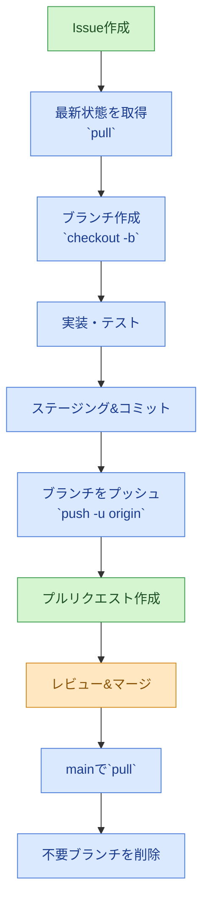

# GitHub練習ガイド（MCP使用版）

このガイドでは、**GitHub MCP**を使ってGitHubの操作を練習しながら学べます。
CursorのAIアシスタントに依頼するだけで、GitHubの操作が自動化できます。

<details>
<summary><h2>✅ Git運用まとめ</h2></summary>

**初回設定**
1. `git init` でフォルダをGit管理下に置く（`.git` が作成される）
2. `git remote add origin <URL>` でGitHubリポジトリと紐付ける
3. 初回の変更を `git add` → `git commit` → `git push` でGitHubへ送信

**開発サイクル（Issue起点）**
1. 課題や改善点をGitHubのIssueとして作成し、対応方針をまとめる
2. `git switch main` → `git pull origin main` で最新状態を取得
3. `git checkout -b feature/issue-番号-内容` などの名前でブランチを作成
4. ブランチで作業・テストを行い、`git add` → `git commit` で履歴に保存
5. `git push -u origin <ブランチ名>` でGitHubへ送信
6. プルリクエストを作成し、レビューを経てマージ（Issueをクローズ）
7. `git switch main` → `git pull origin main` でマージ結果をローカルに反映
8. 役目を終えたブランチを削除（`git branch -d` / `git push origin --delete`）


> 色分け: 青=ローカルで人が操作、緑=MCPで自動操作、橙=GitHub上で実施する作業

</details>

<details>
<summary><h2>🎯 GitHubでできること</h2></summary>


### 1. リポジトリの管理
- コードの保存・共有
- バージョン管理
- 履歴の追跡

### 2. コラボレーション
- プルリクエスト（PR）でのコードレビュー
- イシューでの課題管理
- ディスカッションでの議論

### 3. プロジェクト管理
- プロジェクトボードでの進捗管理
- マイルストーンでの目標設定
- ラベルでの分類

### 4. 自動化
- GitHub ActionsでのCI/CD
- 自動テストの実行
- 自動デプロイ

</details>

<details>
<summary><h2>📋 練習ステップ（MCP使用版）</h2></summary>

### ステップ1: GitHubでリポジトリを作成（MCP使用）
CursorでAIに以下のように依頼：
```
GitHubでリポジトリを作成して。名前は「git-practice」、説明は「GitとGitHubの練習用リポジトリ」で。
```

**MCPで実行される操作：**
- `mcp_github_create_repository` が実行される
- リポジトリが自動的に作成される

### ステップ2: ローカルと連携

> **📘 初期化とは？**
> `git init` は、**Git管理を始めるときに一番最初にやること**です。
> - `git init` を実行すると、このフォルダ内に `.git` という隠しフォルダが作成されます
> - Git が変更履歴を記録できるようになります
> - 一度実行すれば、そのフォルダーはGit管理下になります
> - 以降のファイル変更がコミットとして追跡されます

```bash
# Gitリポジトリを初期化（まだの場合）
cd Git練習
git init  # ← 実行した結果: "Initialized empty Git repository ..."

# リモートを追加
# リモート追加とは：ローカルのGitリポジトリとGitHubのリポジトリを紐付ける作業
# origin = GitHubのリポジトリのURL（名前は「origin」が一般的）
git remote add origin https://github.com/KazukiUrano/git-practice.git
# 確認コマンド: git remote -v で設定を確認できる

# ファイルをステージング
# ステージングとは：コミット前に記録する変更を一時的な「準備エリア」に並べる操作。
# - コミットに含める変更を確認・選別できる（不要な変更を除外できる）。
# - `git diff --staged` でコミット予定の差分を確認できる。
# - 複数ファイルのうち一部だけ先にコミットする、といった調整が可能。
# ステージングだけしておく典型例：
# - 作業途中で、ここまでの変更をひと区切りにして確保しておきたいとき。
# - コミットメッセージを後で考えるため、とりあえずステージしておくとき。
# - 変更内容をレビューしてもらってからコミットしたいとき。
# ステージを外すときは `git restore --staged <file>`、変更自体を破棄するときは `git restore <file>`。
# VS Codeなどでファイル名の左に表示される記号の意味：
# - "U" (Untracked): Gitがまだ追跡していない新規ファイル
# - "A" (Added): 新しく追加されたファイルで、ステージングされている状態
#   → 例: .gitignore, README.md, 練習ファイル1.txt, 練習ファイル2.md
# - "M" (Modified): 既存のファイルが変更され、ステージングされている状態
#   → 例: GitHub練習ガイド.md（既存ファイルを編集してステージングした場合）
#   注意：コミット後にさらにファイルを編集すると、新しい変更が「M」として表示される
#   これは「ステージングされていない変更」を意味する。再度`git add`が必要。
# `git add` を実行すると "U" が "A" や "M" に変わる。
# `git add .` はカレントディレクトリ配下のすべての変更をステージングする。
# 実行前に `git status --short` を見ると `??` （= Untracked）が並ぶ。
# `git add .` 実行後、再度 `git status --short` を見ると `A` や `M` に変わり、ステージ済みと分かる。
git add .
# 実行後は `git status --short` で `A` 表示が並ぶ。
# 実際の結果例：
# A  .cursor/rules/git_practice.md
# A  .gitignore
# A  GitHub練習ガイド.md
# A  README.md
# A  練習ファイル1.txt
# A  練習ファイル2.md

# 最初のコミット
# コミットとは：ステージングした変更を「この時点の状態を記録する」と確定する操作
# `git commit -m "メッセージ"` で実行。メッセージは「何を変更したか」を簡潔に書く
git commit -m "初回コミット: 練習プロジェクトの作成"
# 実行結果例：
# [main (root-commit) 68ef98b] 初回コミット: 練習プロジェクトの作成
#  6 files changed, 390 insertions(+)
# → 6ファイルがコミットされ、390行が追加されたことを示す

# ブランチ名をmainに変更
# 以前は初期ブランチ名が "master" の場合があったため、そのときに `git branch -M main` を実行して "main" に統一した。
# 現在のGitでは最初から "main" になっていることが多いので、`git status` の表示で `On branch main` と出ていれば実行不要。
git branch -M main

# 最初のプッシュ
# `git push -u origin main` でローカルのコミットをGitHubへ送信する。
# - `-u` を付けると次回以降 `git push` だけで同じリモートに送信できる。
# ネットワークや証明書の問題が出た場合は、再試行や権限設定が必要になることがある。
git push -u origin main
```

### ステップ3: イシューを作成（MCP使用）
CursorでAIに以下のように依頼：
```
GitHubのgit-practiceリポジトリにイシューを作成して。
タイトルは「練習用イシュー」、説明は「これはGit練習用のイシューです」で。
```

**MCPで実行される操作：**
- `mcp_github_create_issue` が実行される
- イシューが自動的に作成される
- 実行結果例: Issue #1 「練習用イシュー」が作成され、URL は https://github.com/KazukiUrano/git-practice/issues/1
**イシューをMCPで確認する方法**

- Cursorに「git-practiceのイシュー一覧を見せて」と依頼 → `mcp_github_list_issues` で一覧を取得
- Cursorに「Issue #1 を表示して」と依頼 → `mcp_github_get_issue` で詳細を確認

**GitHubでブランチを確認する方法**

- リポジトリのトップページ右上にあるブランチ名ドロップダウン（初期は `main`）をクリックすると、他のブランチ一覧が表示される
- ドロップダウン内の「View all branches」リンクで `/branches` ページを開くと、最新コミットや削除操作を確認できる
- プルリクエスト画面では比較対象のブランチを選択でき、差分を確認しながらレビューできる

### ステップ4: ブランチで作業

**練習シナリオ（Issue #1「練習用イシュー」）**
1. ブランチ名を決める（例: `feature/issue-1-practice`）。イシュー番号を含めると分かりやすい。
2. 新しいブランチを作成し、同時に切り替える。
3. ブランチ上でファイルを編集する。
4. 変更をステージングし、コミットメッセージにイシュー番号を含める（例: `#1 ガイドにブランチ練習メモを追記`）。
5. ブランチをリモートへプッシュする。

```bash
# ブランチを作成して切り替え
cd Git練習
git checkout -b feature/issue-1-practice

# （エディタでファイルを編集）

# 変更をステージング
git add .

# コミット（例）
git commit -m "#1 ブランチ練習メモを追記"

# ブランチをリモートへプッシュ
git push -u origin feature/issue-1-practice
```

> コツ: 作業が終わったら `git switch main` でメインブランチに戻り、必要に応じて `git pull` で最新化する。
>
> 実践ログ (2025-11-10): `feature/issue-1-practice` ブランチを作成して作業を開始。
> 注意: まだ新しいコミットを作成していない場合、Git Graph では `main` と同じ位置にブランチ名が並び、分岐は表示されません。作業ブランチで最初のコミットを行うとグラフが分岐します。

**ブランチの基本ポイント**
- ブランチはファイル単位ではなく、リポジトリ全体の履歴（コミット）を指すラベル。
- 切り替えると作業ツリー全体がそのブランチ先頭のコミット内容に入れ替わる。
- 個別のファイルだけ別ブランチにすることはできず、同じブランチ上の全ファイルが同じ履歴を共有する。
- 作業途中の変更がある状態でブランチを切り替えるとコンフリクトになることがあるので、切り替え前にコミットやスタッシュをしておくと安心。

**ブランチの状態確認**
- `git status` または `git branch --show-current` で現在のブランチ名を確認できる。
- VS Code の左下ステータスバーにも現在のブランチが表示され、クリックで切り替えが可能。
- Git Graph では左上のドロップダウンからブランチを選択すると、該当ブランチの履歴が強調表示される。

**ブランチ作業完了後の基本フロー**
1. 作業ブランチを `main` など基準ブランチにマージする（通常はGitHubでプルリクエストを作成してマージ）。
2. マージ後の最新状態をローカルで取得：
   ```bash
   git switch main
   git pull origin main
   ```
3. 役目を終えたブランチは削除して整理する：
   ```bash
   git branch -d feature/issue-1-practice        # ローカル削除
   git push origin --delete feature/issue-1-practice  # リモート削除
   ```
   ※ まだマージしていない変更が残っている場合は `git branch -d` でエラーになる。無理に `-D` で削除せず、先に内容を退避させる。

### ステップ5: プルリクエストを作成（MCP使用）
CursorでAIに以下のように依頼：
```
GitHubのgit-practiceリポジトリにプルリクエストを作成して。
feature/新機能ブランチをmainブランチにマージするPRで、
タイトルは「新機能を追加」、説明は「練習用の新機能を追加しました」で。
```

> **補足**: プルリクエスト（Pull Request）は「このブランチの変更を取り込んでください」と依頼する仕組み。ベースブランチ（例: main）と比較ブランチ（例: feature/...）を比較して作成し、レビューしてもらう。
> - PRは必ずブランチ同士で行い、単独のコミットやファイルから直接PRを作ることはできない。
> - ベースブランチはmain以外（例: develop や release）を選ぶこともできる。

**MCPで実行される操作：**
- `mcp_github_create_pull_request` が実行される
- プルリクエストが自動的に作成される

### ステップ6: プルリクエストをマージ（MCP使用）
CursorでAIに以下のように依頼：
```
GitHubのgit-practiceリポジトリのプルリクエスト#1をマージして。
```

**MCPで実行される操作：**
- `mcp_github_merge_pull_request` が実行される
- プルリクエストが自動的にマージされる

### ステップ7: ファイルをGitHub上で作成・更新（MCP使用）
CursorでAIに以下のように依頼：
```
GitHubのgit-practiceリポジトリに「練習用ファイル.txt」を作成して。
内容は「これはMCPで作成したファイルです」で。
```

**MCPで実行される操作：**
- `mcp_github_create_or_update_file` が実行される
- ファイルが自動的に作成・更新される

</details>

<details>
<summary><h2>🔄 よくあるワークフロー（MCP使用版）</h2></summary>

### 機能追加の流れ
1. **イシューを作成（MCP）**
   - AIに「イシューを作成して」と依頼
   - `mcp_github_create_issue` が実行される

2. **ブランチを作成（ローカル）**
   ```bash
   git checkout -b feature/機能名
   ```

3. **コードを書く（ローカル）**
   - エディタでファイルを編集

4. **コミット・プッシュ（ローカル）**
   ```bash
   git add .
   git commit -m "機能を追加"
   git push origin feature/機能名
   ```

5. **プルリクエストを作成（MCP）**
   - AIに「プルリクエストを作成して」と依頼
   - `mcp_github_create_pull_request` が実行される

6. **レビューを受ける（GitHub上）**
   - GitHubのWeb UIでレビューコメントを確認

7. **マージ（MCP）**
   - AIに「プルリクエストをマージして」と依頼
   - `mcp_github_merge_pull_request` が実行される

### バグ修正の流れ
1. **イシューを作成（MCP）**
   - AIに「バグ報告のイシューを作成して」と依頼
   - `mcp_github_create_issue` が実行される

2. **ブランチを作成（ローカル）**
   ```bash
   git checkout -b fix/バグ名
   ```

3. **修正を実装（ローカル）**
   - エディタでバグを修正

4. **コミット・プッシュ（ローカル）**
   ```bash
   git add .
   git commit -m "バグを修正"
   git push origin fix/バグ名
   ```

5. **プルリクエストを作成（MCP）**
   - AIに「プルリクエストを作成して」と依頼
   - `mcp_github_create_pull_request` が実行される

6. **テストを確認（GitHub上）**
   - GitHub Actionsの結果を確認（設定している場合）

7. **マージ（MCP）**
   - AIに「プルリクエストをマージして」と依頼
   - `mcp_github_merge_pull_request` が実行される

</details>

<details>
<summary><h2>💡 MCPでできる便利な操作</h2></summary>

### リポジトリ操作
- **リポジトリの作成**: `mcp_github_create_repository`
- **ファイルの作成・更新**: `mcp_github_create_or_update_file`
- **ファイルの取得**: `mcp_github_get_file_contents`

### イシュー管理
- **イシューの作成**: `mcp_github_create_issue`
- **イシューの更新**: `mcp_github_update_issue`
- **イシューの一覧取得**: `mcp_github_list_issues`
- **イシューへのコメント追加**: `mcp_github_add_issue_comment`

### プルリクエスト管理
- **プルリクエストの作成**: `mcp_github_create_pull_request`
- **プルリクエストのマージ**: `mcp_github_merge_pull_request`
- **プルリクエストのレビュー**: `mcp_github_create_pull_request_review`
- **プルリクエストの一覧取得**: `mcp_github_list_pull_requests`

### その他の便利な機能
- **README.md**: プロジェクトの説明を書く（MCPで作成・更新可能）
- **.gitignore**: コミットしたくないファイルを指定
- **ラベル**: イシューやPRにラベルを付ける（MCPで設定可能）
- **マイルストーン**: 複数のイシューをグループ化

</details>

<details>
<summary><h2>コンフリクトとは</h2></summary>

- 複数の変更が同じファイル・同じ位置に重なり、Gitが自動で統合できない状態。
- 例：メインブランチの行と作業ブランチの同じ行がそれぞれ異なる内容に書き換えられている。
- 発生タイミング：マージ、`git pull`、`git rebase` などで複数の履歴をまとめるとき。
- 解決手順：該当ファイルを開き、`<<<<<<<` `=======` `>>>>>>>` で囲まれた差分を手動で修正 → `git add` でステージ → マージ/リベースを続行。
- 再発防止：こまめに `git pull` して最新状態を取り込み、PRやブランチを長く放置しない。

</details>

<details>
<summary><h2>CI/CDパイプラインとは</h2></summary>

- **継続的インテグレーション (CI)**: 小さな変更を頻繁にリポジトリへ取り込み、自動テストで品質を保つ仕組み。
- **継続的デリバリー/デプロイ (CD)**: CI後の成果物を本番または本番手前の環境へ自動的に届ける流れ。
- **パイプライン**: これらの自動処理を一連のステップ（ビルド→テスト→デプロイ など）としてつないだ仕組み。
- GitHub Actions や CircleCI などのサービスで、`.yaml` のワークフロー定義を使って構築するのが一般的。
- メリット: 手動作業減少・品質向上・リリース頻度アップ。

</details>

<details>
<summary><h2>🎯 MCPを使うメリット</h2></summary>

1. **コマンド不要**: ターミナルでGitコマンドを覚える必要がない
2. **自動化**: AIに依頼するだけで操作が完了
3. **エラー防止**: 手動操作でのミスを減らせる
4. **効率化**: 複数の操作を一度に依頼できる

</details>

<details>
<summary><h2>🎓 次のステップ</h2></summary>

1. **コラボレーション**
   - 他の人と一緒に作業
   - コードレビューを実践

2. **GitHub Actions**
   - 自動テストの設定
   - CI/CDパイプラインの構築

3. **GitHub Pages**
   - 静的サイトのホスティング
   - ドキュメントの公開

4. **リリース管理**
   - タグの作成
   - リリースノートの作成

</details>
